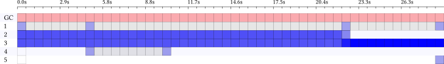

ghc-events-analyze
==================

See [Performance profiling with ghc-events-analyze](http://www.well-typed.com/blog/2014/02/ghc-events-analyze/) for an introduction to this tool.

## Controlling layout

As of version 0.2.5, there are a number of options for controlling the layout.
To slice time coarsely, as we did in the blog post, you can run

```
ghc-events-analyze -b 50 ...
```

This results in something like



To slice time for minely (this was the default for versions 0.2.1--0.2.4), you
can run

```
ghc-events-analyze -b 500 --tick-every 50 --bucket-width 1 --border-width 0
```

The results in something like


