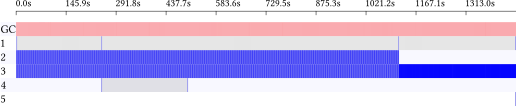

ghc-events-analyze
==================

See [Performance profiling with
ghc-events-analyze](http://www.well-typed.com/blog/2014/02/ghc-events-analyze/)
for an introduction to this tool. Below we describe some features that were
introduced since the blog post.

## Controlling layout

As of version 0.2.3, there are a number of options for controlling the layout.
To slice time coarsely, as we did in the blog post, you can run

```
ghc-events-analyze -b 50 ...
```

This results in something like


By default (in 0.2.0 and again from 0.2.3) time is split into 100 buckets. To
slice time more finely (this was the default for versions 0.2.1 and 0.2.2), you
can run

```
ghc-events-analyze -b 500 --tick-every 10 --bucket-width 1 --border-width 0
```

The results in something like



## Windowing

Windowing can be used to split all events into a bunch of reports, one per
window. You can use it like this:

```
  traceEventIO "START WINDOW"
  ...
  traceEventIO "STOP WINDOW"

  traceEventIO "START WINDOW"
  ...
  traceEventIO "STOP WINDOW"

  traceEventIO "START WINDOW"
  ...
  traceEventIO "STOP WINDOW"
```

If you then run `ghc-events-analyze` using `--window "WINDOW"` it will create
one report per window; for instance, in the above example it would create

```
example.0.timed.svg
example.1.timed.svg
example.2.timed.svg
```

## Event subscripts

Suppose you have multiple events that should all show up as `request` in the
generated reports, but should nonetheless be distinguished from each other.
There are two ways to do this. One is to call the events `request0`, `request1`,
etc.

```
traceEventIO "START request0"
...
traceEventIO "STOP request0"

traceEventIO "START request1"
...
traceEventIO "STOP request1"
```

and then use the `ghc-events-analyze` DSL to add some renaming instructions.
However, that might get tedious if there are a lof of these. Alternatively,
you can use event subscripts, like this:

```
traceEventIO "START 0 request"
...
traceEventIO "STOP 0 request"

traceEventIO "START 1 request"
...
traceEventIO "STOP 1 request"
```

These subscripts are used to distinguish events, but do not show up in the
report.
