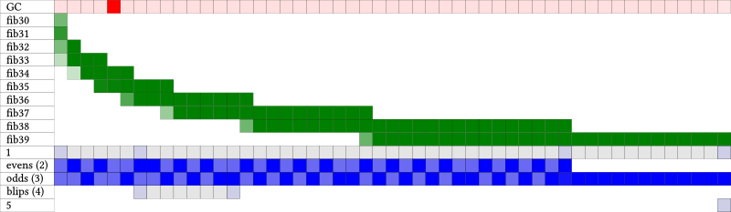
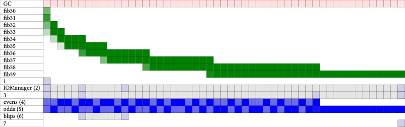
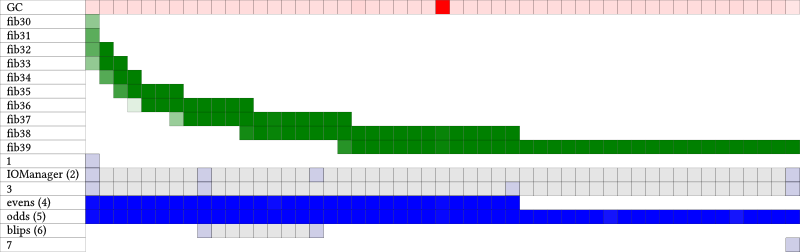
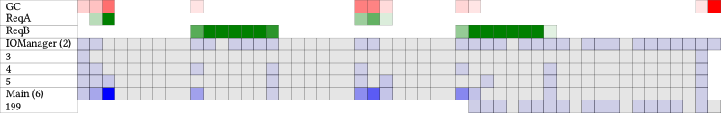
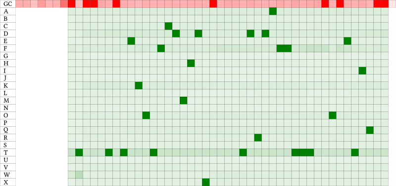

Introducing ghc-events-analyze 
==============================

`ghc-events-analyze` is an alternative visualization tool for eventlogs. It
shows CPU activity across all your threads, and supports visualizing arbitrary
user events. It is very useful for profiling code when ghc's own profiler is
not available, or when you need to trace profiling information over time (as
opposed to totals).

Motivating Example
------------------

Suppose we want to understand the runtime performance of the following simple
multi-threaded application:

    import Control.Concurrent (threadDelay)
    import Control.Concurrent.Async (async, wait)
    
    -- Intentionally slow fib
    fib :: Integer -> Integer
    fib 0 = 1
    fib 1 = 1
    fib n = fib (n - 1) + fib (n - 2)
    
    printFib :: Integer -> IO ()
    printFib n = print (fib n)
    
    blips :: IO ()
    blips = do
      putStrLn "BLIP"
      threadDelay 5000000
      putStrLn "BLIP"
    
    main :: IO ()
    main = do
      a1 <- async $ mapM_ printFib [30, 32 .. 38]
      a2 <- async $ mapM_ printFib [31, 33 .. 39]
      threadDelay 5000000
      a3 <- async $ blips
      mapM_ wait [a1, a2, a3]

We can compile this application and run it on two cores, and ask it to produce
an eventlog:

    ghc ex0 -eventlog
    ex0 +RTS -l

But when we open this eventlog in 
[threadscope](http://hackage.haskell.org/package/threadscope) the result is not
particularly enlightning:

The program was compiled without the `-threaded` flag, forcing all work to run
on a single HEC (Haskell Execution Context -- roughly, a CPU core). This makes
it impossible to see the distribution of workload across the various
application threads.  This will be true whenever multiple threads are executed
by a single HEC (i.e., almost always). If we run the same eventlog through
`ghc-events-analyze` instead we get

Some points to note:

1. `ghc-events-analyze` applies quantization; the total execution time is divided up
   into _n_ buckets (by default 100; for these examples we chose 50) and
   computes for each bucket and each thread what percentage of that bucket 
   the thread was active. 
2. This percentage is used to color each block in the diagram; darker means a
   larger percentage. If the thread was not active at all the block is grey,
   but a percentage _q_ other than 0 is shown as a darkness 0.1 + 0.9 * _q_.
   This means that we can visually see when a thread does anything at all;
   for instance, it is immediately clear from the diagram when the `blips`
   thread (with ID 4) is doing something. If we used the percentage _q_ directly
   as darkness then a thread doing nothing would be visually indistinguishable
   from a thread doing just a print, say.
3. The thread lifetime of each thread is also immediately clear.

Instrumentation
---------------

If we instrument our code, we can improve this diagram in a number of ways. We
can use `labelThread` from `GHC.Conc` to give our threads names, so that it
becomes easier to see what's what. Moreover, `ghc-events-analyze` supports
user events. To use these user events mark the start of a user event with

    traceEventIO "START <eventName>"

and the end with

    traceEventIO "STOP <eventName>"

Note that these user events are completely independent of threads; they can
overlap each other, span multiple threads, etc. Here's our example application
again, but with some instrumentation added:

    import Control.Concurrent (myThreadId, threadDelay)
    import Control.Concurrent.Async (Async, async, wait)
    import Control.Exception (bracket_)
    import Debug.Trace (traceEventIO)
    import GHC.Conc (labelThread)
    
    event :: String -> IO a -> IO a
    event label =
      bracket_ (traceEventIO $ "START " ++ label)
               (traceEventIO $ "STOP "  ++ label)
    
    async' :: String -> IO a -> IO (Async a)
    async' label act = async $ do
      tid <- myThreadId
      labelThread tid label
      act
    
    -- Intentionally slow fib
    fib :: Integer -> Integer
    fib 0 = 1
    fib 1 = 1
    fib n = fib (n - 1) + fib (n - 2)
    
    printFib :: Integer -> IO ()
    printFib n = event ("fib" ++ show n) $ print (fib n)
    
    blips :: IO ()
    blips = do
      putStrLn "BLIP"
      threadDelay 5000000
      putStrLn "BLIP"
    
    main :: IO ()
    main = do
      a1 <- async' "events" $ mapM_ printFib [30, 32 .. 38]
      a2 <- async' "odds"   $ mapM_ printFib [31, 33 .. 39]
      threadDelay 5000000
      a3 <- async' "blips"  $ blips
      mapM_ wait [a1, a2, a3]

Running `ghc-events-analyze` over the eventlog generated by this code yields

If we run the same code using the threaded runtime (but still on a single
core), we get

and if we run it on two cores

We can see that the `evens` and `odds` threads are now in fact running in
parallel, and that the computation of `fib 38` is finished well before the
computation of `fib 39`. 

Totals
------

Bear in mind, however, that `ghc-events-analyze` divides the total time up
into _n_ buckets, so what you can _not_ see from these last two diagrams is
that the total time taken is less when running on two cores. 

`ghc-events-analyze` also outputs some totals. For the single core case it
tells us

    TOTAL GC: 1328667000ns (1.328667s)
    
    USER EVENTS (user events are corrected for GC)
    fib39: 24601468000ns (24.601468s)
    fib38: 21500505000ns (21.500505s)
    fib37: 12982698000ns (12.982698s)
    fib36: 8185847000ns (8.185847s)
    fib35: 5175152000ns (5.175152s)
    fib34: 3137118000ns (3.137118s)
    fib33: 1899554000ns (1.899554s)
    fib32: 1132876000ns (1.132876s)
    fib31: 715864000ns (0.715864s)
    fib30: 462254000ns (0.462254s)
    TOTAL: 79793336000ns (79.793336s)
    
    THREADS
    1: 137000ns (1.37e-4s)
    IOManager (2): 272000ns (2.72e-4s)
    3: 92000ns (9.2e-5s)
    evens (4): 17092563000ns (17.092563s)
    odds (5): 28036898000ns (28.036898s)
    blips (6): 145000ns (1.45e-4s)
    7: 18000ns (1.8e-5s)
    TOTAL: 45130125000ns (45.130125s)

and for the two cores case

    TOTAL GC: 2058497000ns (2.058497s)
    
    USER EVENTS (user events are corrected for GC)
    fib39: 20291034000ns (20.291034s)
    fib38: 13007664000ns (13.007664s)
    fib37: 8401014000ns (8.401014s)
    fib36: 4894527000ns (4.894527s)
    fib35: 3209753000ns (3.209753s)
    fib34: 1934450000ns (1.93445s)
    fib33: 1207082000ns (1.207082s)
    fib32: 723710000ns (0.72371s)
    fib31: 447022000ns (0.447022s)
    fib30: 264689000ns (0.264689s)
    TOTAL: 54380945000ns (54.380945s)
    
    THREADS
    1: 140000ns (1.4e-4s)
    IOManager (2): 238000ns (2.38e-4s)
    3: 91000ns (9.1e-5s)
    evens (4): 20745928000ns (20.745928s)
    odds (5): 32850713000ns (32.850713s)
    blips (6): 74000ns (7.4e-5s)
    7: 11000ns (1.1e-5s)
    TOTAL: 53597195000ns (53.597195s)

Some notes:

1. The total amount of time for each user event is _less_ in the two core case,
   because in the single core case those user events find themselves "waiting"
   for other threads.
2. However, the total time across all _threads_ is approximately much the same
   in both cases; we are still doing the same amount of work, it's just that 
   in the two core case the work of some of those threads is overlapped.
3. In fact, for this particular example (with the user events created as we
   have) we can see from the totals that in the single core case we are doing a
   lot of waiting (taking 79.8s seconds to do 45.1 seconds worth of work),
   while we are doing almost no waiting at all in the two core case (taking
   54.4 seconds to do 54.0 seconds worth of work).  
4. `ghc-events-analyze` corrects user events for garbage collection;
   basically, it simulates that all user events are stopped when garbage
   collection starts, and are resumed again when garbage collection finishes.
   This matches the stop-the-world nature of ghc's garbage collector, and means
   that you can more meaningfully compare total time for different user events.    

Real World Application 1
------------------------

Well-Typed have been developing a server application for a particular client.
The client reported that after certain kinds of requests the server had
unexpected spikes in CPU usage. For technical reasons we could not compile the
server application with profiling enabled, and hence profiling information was
not available. Moreover, profiling would only give us totals, not CPU usage
over time. However, we could generate an eventlog; visualizing the eventlog
with threadscope yielded 

We can make certain educated guesses from this picture: the spikes in activity
are probably different requests coming in at the server, and the reported
unexpected CPU usage reported by the client might be related to garbage
collection (the orange blobs that threadscope reports). However, instrumenting
the code (by labelling some threads and adding user events that correspond to
the server handling different kinds of user requests) and then running it
through `ghc-events-analyze` yielded a more informative picture:

(This uses `ghc-events-analyze`'s `--filter` option to only show certain
events/threads.) The user events clearly show when the server is handing
requests of type A and B, and we see corresponding spikes in CPU activity in
the server's main thread (with ID 6). Threads 4 and 5 handle communication
between the client and server, and we see "blips" at the start and end of each
request, as expected. 

The garbage collection during the A requests is expected, both because of
domain specific knowledge about what type A requests are, but also from the
diagram: there are spikes in CPU usage of the server's Main thread. However,
garbage collection during the B requests is _not_ expected: again, both from
domain specific knowledge about type B rqeuests, but also from the diagram:
there is barely any activity in the system at all, so why so much garbage
collection?

This lead us to suspect "idle GC cycles". The ghc garbage collector will run in
two cases: (1) when required, and (2) when the system is not doing anything
useful anyway. The latter are known as idle GC cycles, and when running an
application you can finetune how often these idle cycles happen. The default is
every 0.3 seconds (provided that there was _some_ activity in the system), but
by specifiying `+RTS -Ix -RTS` you can specify that it should run every _x_
seconds instead. Indeed, running the server with a much lower rate of idle GC
cycles yielded this picture:

Note how we no longer see any garbage collection during B requests; we still
get garbage collection during A requests, but that is expected. Moreover, we
don't see any garbage collection _after_ the second B request either. This was
due to a new thread (199) that was spawned by the second B request. Although
this thread is not very active (low CPU activity), it does just enough to
justify more idle GC runs, even though those idle GC runs are pretty much
wasted effort. 

Real World Application 2
------------------------

Well-Typed was asked to improve the performance of a particular application.
From a high level understanding of the code it was clear that this application
was centered around a single function _foo_, and that the performance of _foo_
might vary dramatically for different inputs. We therefore needed to optimize
_foo_ in different ways given different inputs, but also measure the
performance of _foo_ differently for such different inputs.

The latter fact made it difficult to use ghc's standard profiling tools, and
modifiying the application so that different ways of invoking the function
would be bound to different names (so that we could attach different cost
centres to them) was much too laborious. Moreover, enabling profiling was not
an option for two other reasons. First, this application was very performance
critical, with some parts heavily optimized already, and the instrumentation
added by using a profiling build would skew the results too much. Second, the
program was slow as it is; enabling profiling would make running the program
too slow to work with. 

However, the overhead added by enabling the eventlog is negligible. Moreover,
we can easily use `ghc-events-analyze`'s user events to generate different
kinds of events for different kinds of inputs (like we did in the fib example,
above).  The totals reported by `ghc-events-analyze` enabled us to easily see
what kinds of inputs _foo_ needed to be optimized for the most, and to guide
our improvements (like normal profiling would). 

    TOTAL GC: 25421789435ns (25.421789435s)
    
    USER EVENTS (user events are corrected for GC)
    T: 10574202528ns (10.574202528s)
    F: 5776369439ns (5.776369439s)
    D: 4389066320ns (4.38906632s)
    A: 3939896208ns (3.939896208s)
    K: 3135897321ns (3.135897321s)
    Q: 2706127000ns (2.706127s)
    O: 2586121945ns (2.586121945s)
    W: 2295049375ns (2.295049375s)
    C: 2198859200ns (2.1988592s)
    R: 1791326834ns (1.791326834s)
    X: 1734910406ns (1.734910406s)
    V: 1727701880ns (1.72770188s)
    B: 1709562291ns (1.709562291s)
    E: 1385853161ns (1.385853161s)
    P: 1383600793ns (1.383600793s)
    S: 1165241932ns (1.165241932s)
    H: 1128639979ns (1.128639979s)
    M: 860537704ns (0.860537704s)
    L: 810106269ns (0.810106269s)
    I: 691345817ns (0.691345817s)
    U: 595493497ns (0.595493497s)
    N: 499041244ns (0.499041244s)
    G: 462912372ns (0.462912372s)
    J: 411810877ns (0.411810877s)
    TOTAL: 53959674392ns (53.959674392s)
    
    THREADS
    TOTAL: 0ns (0.0s)

_A_, _B_, etc. are the different kinds of events, corresponding to different
ways of invoking _foo_. TODO: describe what kinds of conclusions we can draw
from this.

In this case the visualization of CPU usage over
time didn't tell us much extra:

It is worth noting however that when we generated this
we selected only user events and GC events (`+RTS -l-agu -RTS`) because the
eventlog would be too big otherwise; `ghc-events-analyze` does not rely on thread
events being available. Moreover, since the creation of this diagram is
relatively time consuming, you can use the `--no-svg` option to omit it if you
are interested in the breakdown of the totals only. 

Availability
------------

`ghc-events-analyze` is available from
[Hackage](http://hackage.haskell.org/package/ghc-events-analyze); the source
code is available from [github](http://github.com/edsko/ghc-events-analyze).
Patches for bug fixes or feature enhancements are welcome!
